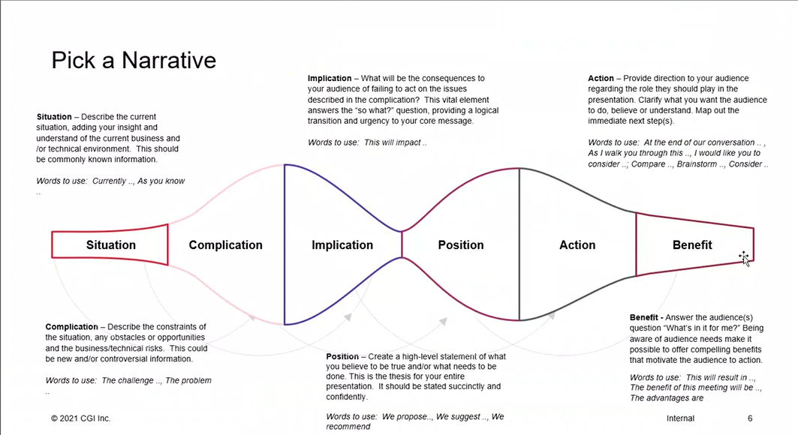
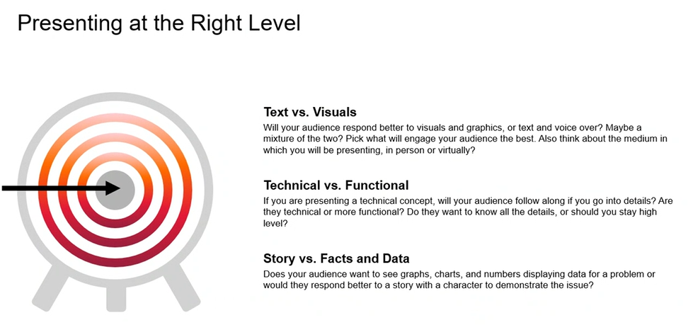

# PowerPoint Notes

## Content tips

- Presentations should not go over 20 pages (5-10 for this presentation)
- Use sentence case for Title and Subtitle on Cover slide as well as slide headings
- Avoid text-heavy slides
- Minimal text
  - Avoid paragraphs
  - Use key phrases / words
  - More slides to break up text
  - When feasible use a graphic - icon or image - to make point instead of text

## Design tips

- Allow for white space
- Use images/ graphics to reinforce messaging, not to fill empty space
- NO detailed graphics
- Don't use clip art
- Obtain rights / permission for images and graphics from an external provider
- Limit the number of colors used on a slide.
- Avoid unnecessary information; every element on a slide should have a purpose.

## Practical

- year and security in footer
- Public use - remove classification box / Internal
- Gradient A/B
  - Right click - format shape
    - Fill
      - Gradient fill (only vertical of horizontal)
        - Preset: no
        - Type: linear
        - Direction
        - Angle: 0 
        - Stops: 3 for A, 4 for B
    - Gradient A: 
      - CGI red (R227 G25 B55): 0%
      - Magenta (R168 G36 B101): 60%
      - Purple (R82 G54 B171): 100%
      - Note: Transparency and Brightness should always be set to 0%.
    - Gradient B:
      - Peach (R255 G205 B210): 0%
      - Orange (R255 G106 B0): 33%
      - CGI Red (R227 G25 B55): 66%
      - Burgundy (R153 G31 B61): 100%
      - Note: Transparency and Brightness should always be set to 0%.
  - Outline - Shape outline, line, fill, gradient line same as above
  - Font color to a gradient 
    - Format, text fill, gradient, more gradients, text options gradient fill

## Color

- **White**: main canvas, helps images and cornerstones standout
- **Gradients**:  cornerstones, occasional color blocks and occasionally in type
- **Red**:  primary color and it is part of both gradients. It’s used for the logo and can be used on type to highlight information, such as calls to action and small titles. It is never used as a solid color in color blocks or in cornerstones
- **Black** is the main typography color. It is never used as a solid color in color blocks or in cornerstones.
- **Purple** is used for links in digital applications and some titles within our templates. It is never used as a solid color in color blocks or in cornerstones. Its main use should be within the gradient.

### Primary

WHITE
R255 G255 B255
HEX #FFFFFF
C0 M0 Y0 K0

CGI RED
R227 G25 B55
HEX #E31937
C0  M100 Y81 K4
PANTONE 186C

PURPLE
R82 G54 B171
HEX #5236AB
C80 M81 Y0 K0
PANTONE 2103C

BLACK
R0 G0 B0
HEX #000000
C0 M0 Y0 K100

### Secondary

- Charts, diagrams, and other visual elements requiring multiple colors

MAGENTA
R168 G36 B101
HEX #A82465
C28 M94 Y0 K4
PANTONE 7648

BURGUNDY
R153 G31 B61
HEX #991F3D
C7 M100 Y68 K32
PANTONE 201C

PURPLE LIGHT
R203 G195 B230
HEX #CBC3E6
C18 M21 Y0 K0
PANTONE 263

PURPLE DARK
R32 G10 B88
HEX #200A58
C99 M100 Y25 K35
PANTONE 273

LIGHT GRAY
R225 G225 B225
HEX #E1E1E1
C10 M10 Y10 K0
Black 13% PMS 664

MAGENTA LIGHT
R203 G124 B163
HEX #CB7CA3
C19 M61 Y12 K0
PANTONE 7431

BURGUNDY LIGHT
R214 G165 B177
HEX #D6A5B1
C14 M38 Y18 K0
PANTONE 501

BURGUNDY DARK
R101 G10 B33
HEX #650A21
C34 M98 Y74 K50
PANTONE 7421

PEACH
R255 G205 B210
HEX #FFCDD2
C0 M18 Y2 K0
Pantone 7422C

ORANGE
R255 G106 B0
HEX #FF6A00
C0 M61 Y97 K0
PANTONE 151C

ORANGE LIGHT
R255 G195 B153
HEX #FFC399
C0 M27 Y40 K0
PANTONE 712

### Special Colors

- Yellow / Green to show certain data variability

YELLOW
R255 G172 B37
HEX #FFAC25

GREEN
R30 G93 B55
HEX #1E5D37

## White space

- White space is any section in your document that is not used.
- We use white space as much as possible in our visuals because it’s proven to attract an audience and help them understand a message.
- When we have less information, less colors and less imagery, our communications become distinctive among the competition and our audience is able to focus on the most important areas of our message.
- when you look at the whole document, it should include a lot of white.
- This doesn't mean that an individual slide or brochure page can’t have a lot of colors; rather, the entire composition should provide enough white space to provide levity to the reader or viewer.

--- 

## Presentation on presentations from Gaby

- Gain trust of client
- Clearly Communicate the Work
- Know Audience
  - No groups are the same
  - Why are they here
  - What are their concerns
  - How can you solve their problems
  - What do you want to do
  - 
- Pick a narrative
- Present at the right level
- Rehearse, rehearse, rehearse
  - Script without sounding scripted

- Balance of text / narration / visuals
- Engage with your Audience
  - Generally two way - how to do over a video?
    - Focus on Tone / Voice / Personalization
    - Inflection / power / tone change for emphasis
    - Pause for dramatic effect
    - Don't speak too fast
    - Personal story
    - Add humor
    - Be formal, but still yourself
- Talk track, write it out, practice multiple times reading script and without
- Record and listen
- Practice to others to get feedback
- More focused on flow and presentation than content
- Text to visuals balance
- Easy to follow
