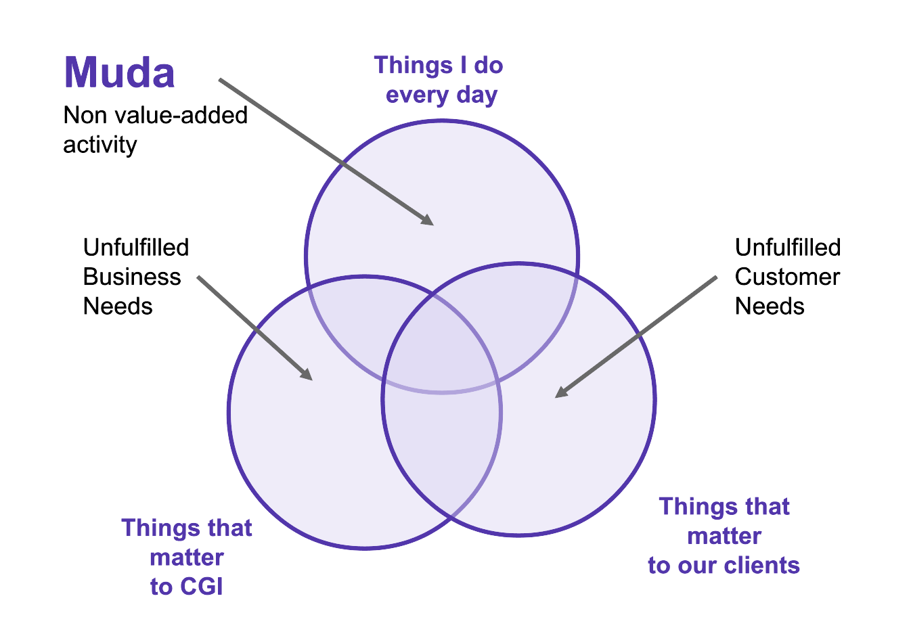

# Having an Outcome-Based Mindset

> Tim Hurlebaus | President US CSG

- 11 in third cohort of Data Engineering group
- Speaking to each SOAR cohort
- Ample time for questions
- Outcomes-based mindset
- Outcome vs. output | doing work on a treadmill but don't necessarily get anywhere

> *"The beginning of wisdom is the correct naming of things." - Confucious*

1. Things that matter to CGI
2. Things that matter to our clients
3. Things I do every day

> *"Begin with the end in mind."-Steven Covey*

- *Seven Habits of Highly Effective People* available in Academia

- Desired "end" = profitable growth
- How?
  - Meet unmet market needs
  - Deliver for our customers
- What happens when we do?
  - Opportunities to learn and grow
  - Investment in members and business
  - Opportunities to solve more problems and deliver new services

## Learning outcomes

- Focus on profitable growth as key outcome
- Operate with an outcome mindset

## Modeling the outcome mindset

- Conversations
  - Set context
  - *The Primes* Chris McGoff
  - FACTS & STORIES
    - Two different people may tell two different stories about the same fact. 60 degrees may be hot or cold depending on where you are from
    - Stories are the way people interpret facts
    - With a certain beliefs, collect only relavant facts
- Email
  - Statement | Security assessment is do to the client tomorrow
  - Request | Joe, will you deliver the security assessment to the question by 9 tomorrow morning?
  - Command | Joe, Deliver the security assessment by 9. Please confirm.
  - *Low-performance leaders dress requests and commands up like statements." - Chris McGoff. Match in the root Cellar*
- Calendar
  - Is time spent taking action to generate profitable growth
  - Be selective. Don't have to attend everything invited to.
  - Being entertained != professional growth and CGI needs
  - If I spend the next hour doing this, is it going to help CGI increase their profit
  - Effort doesn't equate to bottom line
- Meeting
  - Objective | Make decision? | share status?
  - Desired Outcome - by the time the meeting ends
  - People/Role - who do we need and why are they here | expert | presenter | decision-maker
  - Agenda - Do this only after the above three things are established, not before
- Events
  - Networking
    - Clients / potential clients at conference
  - Knowledge Exchange
    - Value I want to contribute from or deliver to conference / meeting
    - Costs time and resources - investment. Make sure you get value returned.
  - Solutions
- Outcome Metrics
  - Revenue | amount of money earned from clients 18% YOY growth
  - Contribution | profit at corporate level
  - Cash | bill 100 hours April @ 100/hour = 10,000 | accrual accounting earned / bill | delay between when we say we earned money and when we collect and have it
  - Attrition/Hiring | professional services business | you and capabilities and services are what we are selling | have to attract 6,600 USCSG 82,000 worldwide
- Leading Indicator Metric - predict what may happen as an outcome metric | not outcomes themselves
  - Bookings - win a new contract (only leading, could be cancelled)
  - MSAP - member satisfaction. Scored 9, but still leave
  - CSAP
  - EIEs / Sales Calls
  - Gross Margins

## Resources

- March in the Root Cellar
- Seven habits of highly effective people
- Leadership institute
- Leadership insights on networking

## Questions

- Recommendations for progresing from this first job with CGI into mindfully managing our career.
  - 34 years
  - COBAL
  - IT field
  - Dupont relocation
  - Built custom financial system
  - IP solutions CIA - Weekly football pool - Cincinnati Ohio PWC - Bengals - Wife
  - Industry to industry
  - Los Alamos
  - *Try to say yes* not a hey, I've never done that. Know enough about enough. Plenty of people around me. Show up and engage and try work hard.
  - Meet people and network. Get to know people and stay in touch. Reach out in three months. Somewhere down the road - may need to work together on a team. Workforce managers there, but must advocate for yourself through building and maintaining your network.

- Make sure you aren't on that treadmill
  - On a regular basis, (quarter / 6 months) determint something relavant you want to learn and design
  - Goals
  - Share with manager
  - Re-evaluate
    - DId this, didn't do that, did this other thing

- How to find a mentor?
  - Somebody that you click with
  - Rapport - knows you well enough to know your strengths / weakness
  - Can't be assigned
  - Can assign a coach or buddy, but need a certain chemistry for a mentor
  - Chris McGoeff 25-year mentor

- Settled
  - Takes a year to get *really* comfortable at a new role.
  - Wouldn't be here if you didn't have the ability to succeed
  - Should have a foundation of both confidence and humility

- MSAP
  - 8.5 average fact/story said it was high, but attrition was outside range
  - Every member given a survey 13-14 questions
  - Listen to feedback - specific actions to address comments?
